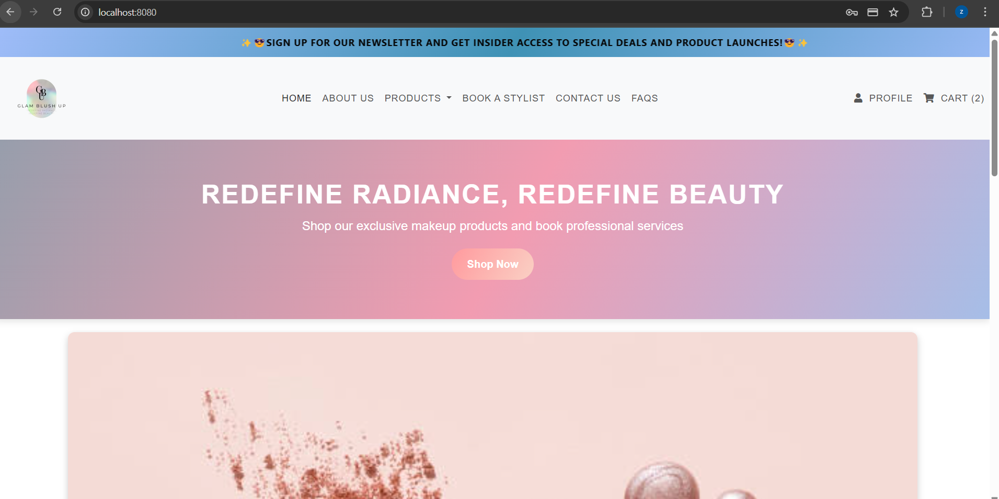

# Glam BlushUp - Makeup Store Website (Module 3)


**Glam BlushUp** is a modern e-commerce platform dedicated to selling makeup products for everyone—women, men, and kids. It is an all-inclusive, one-stop shop for all your makeup needs. Our goal is to provide a seamless shopping experience with a responsive design and a fully functional shopping cart system. **Glam BlushUp** offers easy navigation, secure user authentication, and a user-friendly catalog to make shopping for makeup products a breeze.


## Table of Contents
- [Live Demo](#live-demo)
- [Technologies Used](#technologies-used)
- [Setup Instructions](#setup-instructions)
- [Key Features](#key-features)
- [Credits](#credits)
- [Author](#author)

## 🚀 **Requirements and Technology Used**

- **Node.js** (Version 14.x or later recommended)
- **MySQL Database**
- **Vue.js 3** (Frontend Framework)
- **npm** (Node Package Manager)

<hr style="border: 2px solid #000;">


## 📦 **Dependencies**
This is to be added in the terminal in VS Code after cloning the repository. These are needed in order to run the web application.
### **Backend**
```bash
npm i
```

### **Frontend**
```bash
npm install -g @vue/cli
npm install vue-router  
npm install axios  
npm install vue-toastification
npm install @fortawesome/fontawesome-free
npm install @vue/cli-service --save-dev
npm install -g @vue/click
```

---

## ✨ **Features**

1. Login and registration functionality
2. Catalog implementation
3. Shopping cart and order processing
4. Authentication and user management
5. Live demonstration of key website functionalities
6. Influencer tutorial video
7. Booking system
8. Social media platform integration

---

## ⚙️ **Setup Instructions**

### **1. Clone or Download the Project**

```bash
git clone https://github.com/Zainunesa/Glamblushupfrontend.git
```

---

## 📂 **Folder Structure**

```plaintext
GlamBlushUp
├── Backend
│   ├── config
│   │   └── config.js
│   ├── controllers
│   │   ├── adminController.js
│   │   ├── adminCustomerController.js
│   │   ├── adminOrderController.js
│   │   ├── adminProjectController.js
│   │   ├── bookingController.js
│   │   ├── orderController.js
│   │   ├── productController.js
│   │   └── userController.js
│   ├── models
│   │   ├── adminCustomerModel.js
│   │   ├── adminLogin.js
│   │   ├── adminOrderModel.js
│   │   ├── adminProductModel.js
│   │   ├── bookingModel.js
│   │   ├── ordersModel.js
│   │   ├── productModel.js
│   │   └── userModel.js
│   ├── routes
│   │   ├── adminCustomerRoutes.js
│   │   ├── adminOrderRoutes.js
│   │   ├── adminProductRoutes.js
│   │   ├── adminRoutes.js
│   │   ├── bookingRoutes.js
│   │   ├── orderRoutes.js
│   │   ├── productRoutes.js
│   │   └── userRoutes.js
│   ├── .env
│   ├── index.js
│   ├── package-lock.json
│   ├── package.json
│   └── README.md
├── Frontend
│   ├── node_modules
│   ├── public
│   │   ├── index.html
│   │   └── favicon.ico
│   ├── src
│   │   ├── assets
│   │   │   ├──all images and videos
│   │   ├── components
│   │   │   ├── all relevant components
│   │   ├── router
│   │   │   └── index.js
│   │   ├── store
│   │   │   └── index.js
│   │   ├── views
│   │   │   ├── all relevant view files
│   │   ├── api.js
│   │   ├── app.vue
│   │   ├── globalState.js
│   │   ├── main.js
│   │   ├── babel.config.js
│   │   ├── jsconfig.json
│   │   ├── package-lock.json
│   │   ├── package.json
│   │   ├── README.md
│   │   └── vue.config.js
```

---

## 🛠 **Database Configuration**

1. Import the provided `blushup.sql` file into your MySQL database.
2. Update `config.js` with your database credentials:

```javascript
export const db = mysql.createPool({
  host: 'localhost',
  user: 'root',
  password: 'yourpassword',  // Replace with your actual password
  database: 'blushup_db'
});
```
As well as .env file:

```
HOSTNAME = '127.0.0.1'
    USER ='root'
    PASSWORD = 'yourpasswordhere*' // Replace with your actual password
    DATABASE = 'blushup_db'

port=3001
```

---

## 🚀 **Running the Application**

### **Backend**
```bash
cd Backend
node --watch index.js
```

### **Frontend**
```bash
cd Frontend
npm install
npm run serve
```

### **Access the System**
Open a browser and visit:
```bash
http://localhost:8080/
```
## **Payment Credentials**
Card Number: 4111111111111111 (4111 1111 1111 1111)

Expiry Date (MM/YY): 12/25

CVV:123
---

## 🔑 **Login Instructions**

### **Admin Access**
- Normal signup and login required.
- To access the admin portal, manually change the `user_role` column in the `users` table to `'admin'`.

### **Customer Access**
- Normal signup and login required.
- Customers will have an empty `user_role` field by default.

### **Booking Access**
- Login is required to book a stylist.

---

## **Website Preview**
<div style="display: flex;flex-direction: column; grid-gap: 10px;">
     <div style="display: flex; grid-gap: 10px;">
        
        
      
        
      
        
        
        
        
        
    </div>
</div>

---

  ## Potential Improvements
[List of ideas for future enhancements, such as:]
* Styling (CSS could be improved)

## Credits
Life Choices Academy - in collaboration with:
**Zainunesa Magmoed,** 
**Cwayita Ngcwayi,** 
**Nandipha Zigwebile,** 
**Usisipho Mxinwa**


## 📝 **Additional Notes**
- The system allows customers to shop, add products, and book a stylist.
- Admins can log in to manage orders, products, and users.
- If any issues arise during setup, check error logs to ensure database queries and server configurations are correct.

---
Collaborators:

**📌 Zainunesa Magmoed**
**📌 Cwayita Ngcwayi**
**📌 Nandipha Zigwebile**
**📌 Usisipho Mxinwa**
